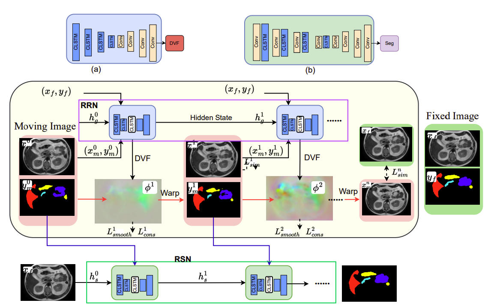

### ProRSeg
### Progressively refined deep joint registration segmentation (ProRSeg) of gastrointestinal organs at risk: Application to MRI and cone-beam CT 



## Prerequisites
- Linux
- Python 3.9
- NVIDIA GPU with CUDA CuDNN (CUDA 11.8 or higher)

## To get started
- Clone this repository
- Install pytorch (our GPU is at CUDA 11.8, so we use the following command `pip install torch==2.1.0 torchvision==0.16.0 torchaudio==2.1.0 --index-url https://download.pytorch.org/whl/cu118`)
- Install the requirements using `pip install -r requirements.txt`
- The data should be present in the `datadir` folder, with the json organizing each instance under `train` and `validation` keys respectively
- For training:
    - Run the training script using the following command:
        ```bash
        python register_images.py \
        --datadir {path to datadir} \
        --json {json_name} \
        --image_loss {loss function to use} \
        --cache {Load images in memory}
        ```
 ## Note
 - The set of codes naturally assume that the name of the image is the last piece of information in the json file. If this is not the case, edit <a href="https://github.com/The-Veeraraghavan-Lab/ProRSeg/blob/main/train.py#L463">this line</a> under `train.py`
- For optimal performance, preprocess the images offline before running the model. The preprocessing includes:
    1. Rigid Registration
    2. Scan background cropping
    3. Resizing
    4. Histogram Matching
- By default, the HD95 calculation during the training validation step is in voxel units. To change this setting, modify the <a href="https://github.com/The-Veeraraghavan-Lab/ProRSeg/blob/main/train.py#L527">this line</a> in `train.py` to include the actual spacing of each image being fed to the model
  
## Citation
If you use this code for your research, please cite our paper <a href="https://arxiv.org/abs/2210.14297">ProRSeg</a>:

```
@article{jiang2023progressively,
  title={Progressively refined deep joint registration segmentation (ProRSeg) of gastrointestinal organs at risk: Application to MRI and cone-beam CT},
  author={Jiang, Jue and Hong, Jun and Tringale, Kathryn and Reyngold, Marsha and Crane, Christopher and Tyagi, Neelam and Veeraraghavan, Harini},
  journal={Medical physics},
  volume={50},
  number={8},
  pages={4758--4774},
  year={2023},
  publisher={Wiley Online Library}
}
```
